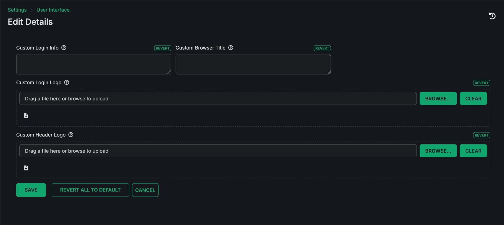
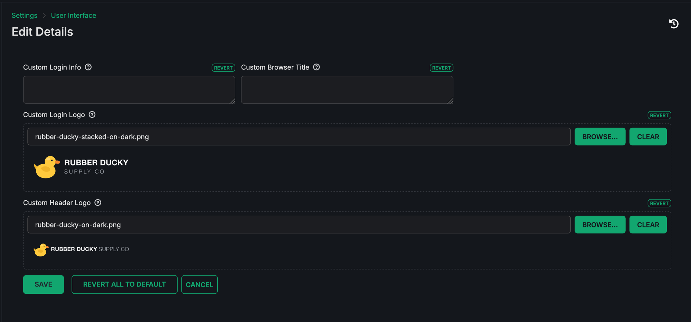
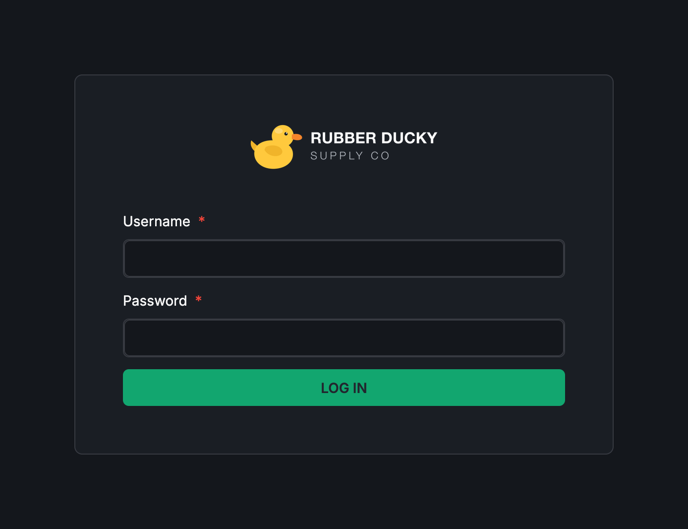
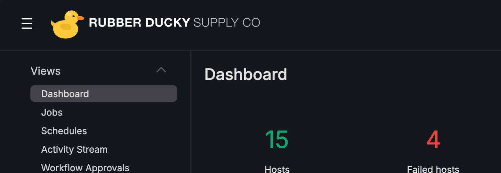
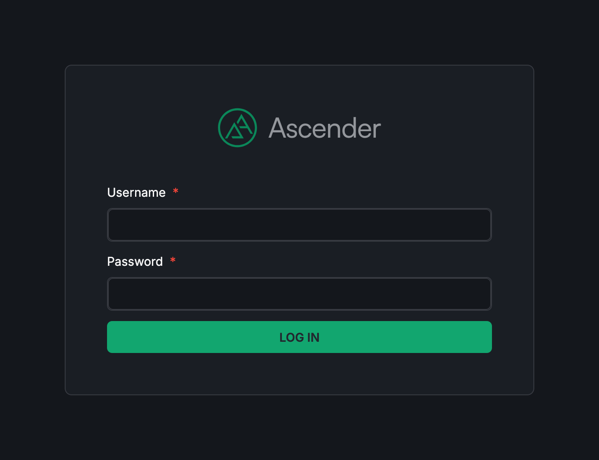

Ascender supports rebranding the login screen, the application header, and the browser tab title, and adding your own notice to the login screen. All of these are configured from the **User Interface settings** of the Settings menu.

.. note::

	The settings described here apply to Ascender 25.4.0 and later.

Custom logos
--------------

There are two logo settings:

**Custom Login Logo** (``CUSTOM_LOGO``) replaces the Ascender logo on the login screen.

**Custom Header Logo** (``CUSTOM_HEADER_LOGO``) replaces the Ascender logo in the application header that is shown on every page after login.

If you are upgrading from a release where you had set the older **Custom Menu Logo** option, that value does not carry forward. The header logo is a separate setting, so upload your logo again here.

Both settings accept GIF, PNG, and JPEG images. SVG is not supported. Use a ``.png`` file with a transparent background for the best result.

The two logos are sized on different axes: the login logo is capped at 192 pixels wide, and the header logo at 46 pixels tall. Each scales to fit, so keep the aspect ratio in mind when choosing an image.

Each logo is stored as a base64-encoded data URL, in the form ``data:image/png;base64,<encoded data>``. The Settings form encodes the file for you on upload. If you set either value through the API instead, supply the full data URL yourself.

There is no enforced file size limit, but keep the images small. Both values are stored as settings and served to the browser on page load, so a large image slows down the initial render for every user.

Once a file is uploaded, the form shows a preview of each logo:

After saving, the login screen uses the **Custom Login Logo** in place of the Ascender logo:

The **Custom Header Logo** replaces the Ascender logo in the header, which appears on every page once you are logged in:

Custom browser title
----------------------

**Custom Browser Title** (``CUSTOM_TITLE``) replaces the default brand name in the browser tab title throughout the application. With it set, tab titles read ``<your title> | Jobs`` rather than ``Ascender Automation | Jobs``, and the login page tab shows your title on its own. Leave it blank to fall back to the default brand name.

A session that is already open keeps the old title until the page is reloaded, because the running application does not refetch the setting.

Custom login info
-------------------

**Custom Login Info** (``CUSTOM_LOGIN_INFO``) adds a block of text to the login screen, such as a legal notice or a disclaimer. Use plain text or an HTML fragment; other markup languages are not supported.

Reverting to the defaults
---------------------------

Each setting has its own **Revert** control, which restores that one setting. **Revert all to default** resets every UI setting, including ones that are not on this form such as the maximum job events retrieved by the UI and live updates, so use the per-setting control if you only mean to drop a logo.

Reverting these settings restores the standard Ascender logo and brand name:

