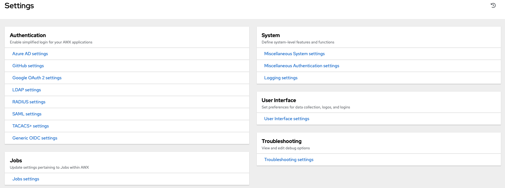

.. index::
   single: controller settings menu
   single: license, viewing
   pair: settings menu; view license
   pair: settings menu; configure the controller

To enter the Settings window for Ascender, click **Settings** from the left navigation bar. This page allows you to modify your Ascender configuration, such as settings associated with authentication, jobs, system, and user interface.

For more information on configuring these settings, refer to :ref:`ag_configure_ascender` section of the |ata|.