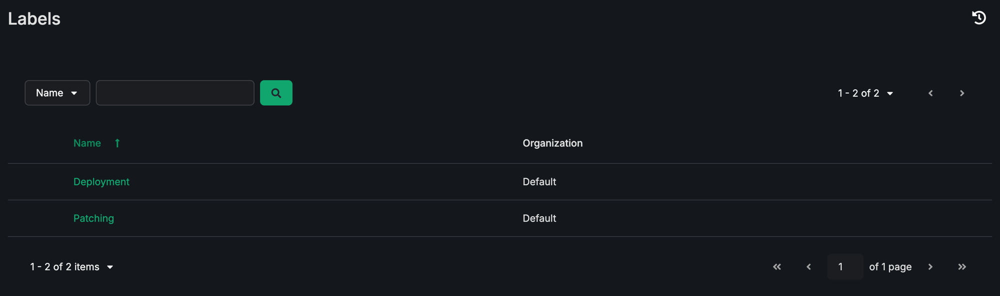

.. _ug_labels:

Labels
========

.. index::
   single: labels
   pair: labels; listing view
   pair: labels; templates
   pair: templates; organizing

The **Labels** view lists the labels in use across your templates and lets you open the templates that carry each one. Access it by clicking **Labels** from the **Resources** section of the left navigation bar. Ascender has no folders for templates, so this view is how you browse templates by group.

A label is a short piece of text, such as "dev" or "networking", that you attach to a template to describe it. You create a label by adding it to a template, and each label belongs to the Organization of the template's Project. The **Labels** field in :ref:`ug_JobTemplates` covers adding and removing them.

The list shows two columns. **Name** is the text of the label, and clicking the sort control on this column orders the list alphabetically. **Organization** is the Organization the label belongs to. Use the search field above the list to filter by label name, or switch the search key to **Organization** to filter by Organization name. Both searches match partial text.

.. note::

  Only labels that are in use appear in this list. A label that is not attached to any template is not shown, so removing a label from the last template that references it also removes it from this view. This list is read-only. You create, rename, and remove labels from the templates that use them, not from this screen.

To see the history of changes to labels, click the Activity Stream (|activitystream|) button from the **Labels** view.

.. _ug_labels_pseudo_folders:

Using labels as pseudo-folders
--------------------------------

Ascender has no folders for templates. A label used as a pseudo-folder gives you the same result: the label is the folder, and the templates carrying it are its contents.

Clicking a label name opens the **Templates** view filtered to the templates that carry that label. The filter is scoped to the label's Organization, so a label of the same name in another Organization is a separate label and its templates do not appear.

To organize your templates this way:

1. Decide on the groupings you want, for example one label per team, per environment, or per application.
2. Add the appropriate label to each template using the **Labels** field on the template, as described in :ref:`ug_JobTemplates`. A template can carry more than one label, so one template can appear in several groupings.
3. Click **Labels** from the left navigation bar, then click a label name to see the templates in that grouping.

.. warning::

  Clicking a label name matches every label whose name *contains* the text you clicked, not only the label you clicked. If you have both a ``dev`` label and a ``dev-east`` label, clicking ``dev`` returns the templates from both. The match runs one way: clicking ``dev-east`` returns only its own templates, because ``dev`` does not contain ``dev-east``. A short label therefore absorbs every longer label that starts with or includes it.

Name your labels so that no label name contains another. A consistent prefix and suffix, such as ``env-dev`` and ``env-east``, keeps the groupings distinct. Labels have no hierarchy, so express any nesting in the name itself, for example ``platform-networking`` and ``platform-storage``.
